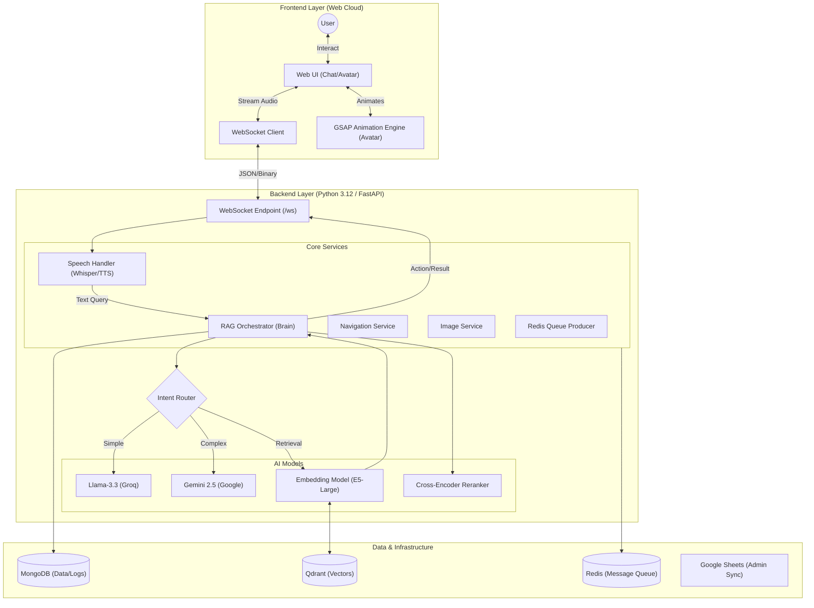
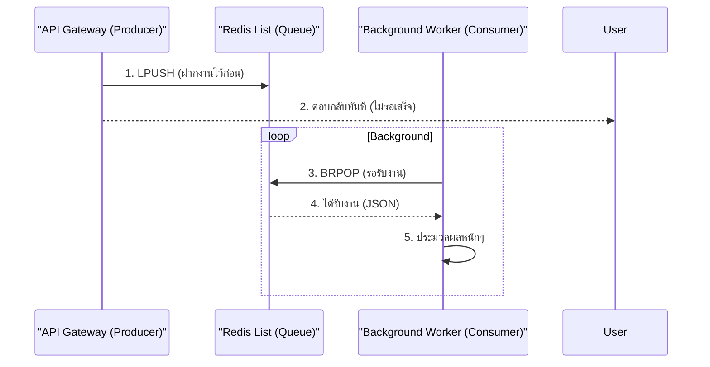

# 🏛️ สถาปัตยกรรมและโครงสร้างระบบ (System Architecture & Structure Bible) - AI Robot Guide

เอกสารฉบับนี้คือ **"คัมภีร์หลัก" (Master Document)** ที่รวบรวมข้อมูลเชิงลึกทางเทคนิคทั้งหมดของโครงการ **AI Robot Guide จังหวัดน่าน** และแผนขยายสู่ **Universal AI-PR Platform** ไว้ในที่เดียว เพื่อให้ทีมพัฒนาเข้าใจโครงสร้าง การทำงาน และทิศทางของระบบอย่างสมบูรณ์

---

## 1. วิสัยทัศน์และความสามารถ (Vision & Capabilities)

### 1.1 Vision: "From Local Guide to Universal Platform"
เรากำลังเปลี่ยนจากโปรเจค "หุ่นยนต์นำเที่ยวจังหวัดน่าน" ยกระดับสู่การเป็น **"Platform-as-a-Service (PaaS)"** ที่เปิดโอกาสให้ ใครก็ได้ (บุคคลทั่วไป, ร้านค้า, องค์กร) สามารถเข้ามาสร้าง AI หรือ "ร่างโคลนอัจฉริยะ" ของตัวเองได้ง่ายๆ โดยไม่ต้องเขียนโค้ด

### 1.2 ฟีเจอร์หลักในปัจจุบัน (Current Features)
*   **Interactive AI Avatar:** หุ่นยนต์ 3D ที่ขยับปากตรงตามเสียงพูด (Lip-Sync) และแสดงอารมณ์ได้ (GSAP Engine).
*   **Voice-First Experience:** สนทนาด้วยเสียงเรียลไทม์ (Groq Whisper + EdgeTTS Streaming) Latency ต่ำกว่า 1 วินาที.
*   **Dual-Brain RAG:** ระบบสมองคู่ขนาน:
    *   **Fast Brain (Llama 3 @ Groq):** ตอบโต้บทสนทนาทั่วไป (Small Talk) ทันที.
    *   **Deep Brain (Gemini 2.5):** วิเคราะห์คำถามซับซ้อนและข้อมูลท่องเที่ยวเชิงลึก.
*   **Hybrid Search:** ค้นหาแม่นยำด้วยการใช้ทั้ง Keyword Search (Mongo) และ Semantic Vector Search (Qdrant) ร่วมกับ **Reranker**.
*   **Smart Navigation:** คํานวณเส้นทางและเปิดแผนที่นำทางได้ทันที.
*   **Entertainment:** เปิดเพลงจาก YouTube และเล่าเรื่องราวได้.

---

## 2. สถาปัตยกรรมระบบ (System Architecture)

ระบบใช้สถาปัตยกรรมแบบ **Single Python Backend (Monolithic Modular)** ที่มีประสิทธิภาพสูง ดูแลรักษาง่าย และยืดหยุ่น



### 2.1 จุดเด่นของสถาปัตยกรรม
1.  **Centralized Logic:** รวม Logic ไว้ที่ Python Backend (`/Back-end`) จุดเดียว ลดความซับซ้อน.
2.  **Streaming First:** ออกแบบให้รองรับการ Stream เสียงและข้อความตั้งแต่ต้นน้ำจนถึงปลายน้ำ (TTS Streaming).
3.  **Modular Design:** แยกส่วน Speech, RAG, และ Database ชัดเจน สามารถถอดเปลี่ยนโมเดล (เช่นเปลี่ยนจาก Gemini เป็น GPT-4) ได้โดยไม่กระทบส่วนอื่น.

---

## 3. โครงสร้างโปรเจกต์ (Project Structure)

### 📂 Root Directory
*   `apps/web-cloud`: **Frontend Application** (HTML/JS/CSS)
    *   `index.html`: หน้าหลัก
    *   `chat.html`: หน้าจอแชทหลัก
    *   `robot_avatar.html`: หน้าจอ Avatar 3D
    *   `assets/scripts/`: Logic ภาษา JavaScript (e.g., `chat.js`, `config.js`)
*   `Back-end`: **Backend Application** (Python)
    *   `api/main.py`: Entry point ของ server (FastAPI)
    *   `core/`: Business Logic ทั้งหมด
    *   `core/ai_models/`: Modules สำหรับ RAG, Speech, LLM Handlers
    *   `workers/`: Background Workers (รับงานจาก Redis)
*   `docker-compose.yml`: ไฟล์กำหนด Infrastructure (Mongo, Qdrant, Redis)
*   `start_all.sh`: สคริปต์เปิดระบบทั้งหมด (One-click start)

### 📂 เจาะลึกไฟล์สำคัญใน Backend
*   **`core/ai_models/rag_orchestrator.py`:** "มันสมอง" ของระบบ
    *   ควบคุม Flow การทำงาน: รับคำถาม -> ตรวจ Intent -> ค้นหา -> สร้างคำตอบ -> บันทึก Log.
    *   จัดการ **Self-Correction Logic**: ถ้าความมั่นใจต่ำ (Confidence < 0.45) ระบบจะแจ้งเตือนหรือเปลี่ยนวิธีตอบ.
*   **`core/ai_models/speech_handler.py`:** "ปากและหู"
    *   **STT:** ใช้ Groq Whisper (Cloud) เป็นหลัก ถ้าล่มสลับไปใช้ Local Faster-Whisper.
    *   **TTS:** ใช้ Edge-TTS สร้างเสียงแบบ Streaming (yield bytes) ส่งกลับไปทันที.
*   **`core/database/qdrant_manager.py`:** "ความจำระยะยาว"
    *   ดูแลการฝาก-ถอนความรู้ (Vectors) และการ Search แบบ Semantic.

---

## 4. เจาะลึกระบบ: การทำงานของ RAG Pipeline (The Brain)

กระบวนการคิดของ AI เมื่อได้รับคำถาม (เช่น "วัดภูมินทร์สร้างเมื่อไหร่"):

1.  **Input Analysis (วิเคราะห์):**
    *   `QueryInterpreter` ตรวจสอบเจตนา (Intent) และสกัด Entity (เช่น "วัดภูมินทร์").
2.  **Retrieval (ค้นหา):**
    *   **Direct Search:** ค้นหาชื่อตรงๆ ใน MongoDB (แม่นยำ 100% สำหรับสถานที่เฉพาะ).
    *   **Vector Search:** ค้นหาความหมายใกล้เคียงใน Qdrant.
    *   **Trending:** ดึงข้อมูลยอดนิยมมาผสมหากคำถามกว้างๆ.
3.  **Reranking (จัดลำดับ):**
    *   ใช้โมเดล **Cross-Encoder** ให้คะแนนความเกี่ยวข้องใหม่ (Re-score).
    *   ดันข้อมูลที่ตรงชื่อ (Direct Match) หรือยอดนิยม (Trending) ขึ้นบนสุด.
4.  **Generation (สร้างคำตอบ):**
    *   ส่ง Context ที่ดีที่สุด (Top 5) ให้ LLM (Gemini/Llama).
    *   Prompt Engineering กำกับให้ตอบสั้น กระชับ และเป็นธรรมชาติ.
5.  **Audit (ตรวจสอบ):**
    *   ตรวจสอบคะแนน Confidence หากต่ำเกินไป จะตอบว่าไม่ทราบ หรือแนะนำเรื่องอื่นแทน (Self-Correction).

---

## 5. การจัดการ Blocking I/O และระบบคิว (Performance & Queue Guide)

เพื่อให้ระบบรองรับผู้ใช้งานพร้อมกันได้จำนวนมาก เราใช้เทคนิคการจัดการ I/O และ Message Queue ดังนี้:

### 5.1 ปัญหา Blocking I/O ใน FastAPI
ใน Python `async def`, หากมีการเรียกใช้ Code ที่กินเวลานาน (เช่น การเชื่อมต่อ Database แบบ Sync, การประมวลผลไฟล์ภาพ) โดยไม่มี `await`, ระบบจะ **"ค้าง" (Block)** และไม่สามารถรับ Request อื่นได้

**วิธีแก้ไข:**
1.  **ใช้ Async Library:** เช่น `motor` แทน `pymongo` (โปรเจคนี้ใช้ `pymongo` แต่รันใน Threadpool).
2.  **run_in_threadpool:** หากเลี่ยง Library แบบ Sync ไม่ได้ ให้ใช้คำสั่งนี้:
    ```python
    from fastapi.concurrency import run_in_threadpool
    # ย้ายงานหนักไปทำใน Thread แยก ไม่ขวาง Main Loop
    result = await run_in_threadpool(sync_function, arg1, arg2)
    ```

### 5.2 ระบบคิวด้วย Redis (Task Queue Architecture)
สำหรับงานที่ใช้เวลาประมวลผลนานมาก (เช่น การสร้างสรุปข่าวรายวัน, การวิเคราะห์ข้อมูลย้อนหลัง) เราใช้โมเดล **Producer-Consumer**:



*   **Producer:** FastAPI รับ Request -> โยน JSON ลง Redis -> จบงานทันที.
*   **Consumer:** Script แยก (`workers/worker_line.py`) วนลูปหยิบงานจาก Redis มาทำทีละชิ้น.

---

## 6. แผนขยายระบบในอนาคต (Future Roadmap)

1.  **Multi-Tenancy:** ปรับ Database ให้รองรับผู้ใช้งานหลายคน (แยก Knowledge Base ของใครของมัน).
2.  **Authentication:** เพิ่มระบบ Login สำหรับเจ้าของ AI.
3.  **Advanced Analytics:** แดชบอร์ดวิเคราะห์พฤติกรรมผู้ใช้ที่ละเอียดขึ้น.

---
*เอกสารฉบับนี้รวบรวมและปรับปรุงข้อมูลล่าสุดเมื่อ: December 2025*
