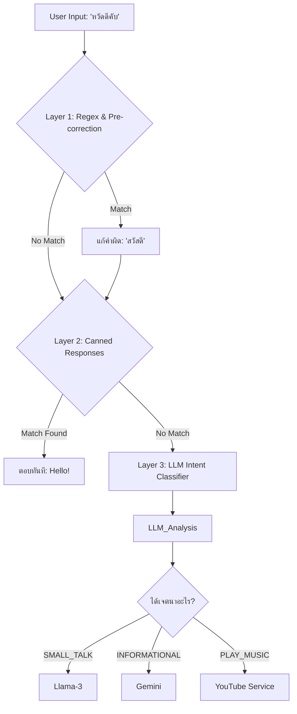

# 🧠 เจาะลึกกระบวนการคิดและการตัดสินใจของ AI (AI Cognitive Architecture)

เอกสารฉบับนี้ไม่ได้พูดถึง "เซิร์ฟเวอร์" หรือ "ฐานข้อมูล" แต่จะเจาะลึกไปที่ **"ความคิด" (Cognitive Process)** ของ AI ว่าเมื่อได้รับข้อความหนึ่งประโยค ระบบมีกระบวนการตัดสินใจอย่างไร (Decision Making) ทำไมถึงเลือกตอบแบบนั้น และมีกลไกอะไรบ้างที่ทำให้มันทำงานได้รวดเร็วแต่ยังคงความฉลาด

---

## 1. การดักจับเจตนา (Intent Classification Pipeline)

เพื่อความเร็วสูงสุด ระบบไม่ได้ส่งทุกข้อความไปให้ LLM ประมวลผลทันที แต่ใช้ **"ระบบกรอง 3 ชั้น" (3-Layer Filtering)** เพื่อประหยัดเวลาและค่าใช้จ่าย

### 📉 Diagram: The 3-Layer Filter



### 🔍 รายละเอียดแต่ละชั้น:

1.  **Layer 1: Pre-correction (กฎตายตัว):**
    *   **หน้าที่:** แก้คำผิดยอดฮิตทันทีโดยไม่ต้องใช้ AI
    *   **ตัวอย่าง:** "หวัดดีคับ" → "สวัสดี", "วัดพูมิน" → "วัดภูมินทร์", "เสมอดาว" → "ดอยเสมอดาว"
    *   **ประโยชน์:** ลดภาระให้ AI ไม่ต้องงงกับภาษาวิบัติ
2.  **Layer 2: Canned Responses (ตอบอัตโนมัติ):**
    *   **หน้าที่:** ตรวจสอบคำสั้นๆ ที่ไม่ต้องใช้สมองคิด
    *   **ตัวอย่าง:** ถ้าเจอคำว่า "ขอบคุณ" ระบบจะ Maps ไปเป็น intnet `THANKS` และจบงานทันที
    *   **ประโยชน์:** Latency เป็น 0ms (ไม่เสียเวลาเรียก API)
3.  **Layer 3: LLM Classifier (สมองส่วนหน้า):**
    *   **หน้าที่:** ถ้าไม่เข้ากฎข้อ 1-2 จะส่งไปให้ **Local LLM (Llama-3)** ช่วยวิเคราะห์และแตก JSON ออกมา
    *   **Input:** "หิวข้าว แนะนำหน่อย"
    *   **Output:**
        ```json
        {
          "intent": "INFORMATIONAL",
          "category": "food",
          "entity": null,
          "is_complex": false
        }
        ```

---

## 2. อัลกอริทึมการค้นหาข้อมูล (The Hybrid Search Algorithm)

เมื่อรู้แล้วว่า user ต้องการ "ข้อมูล" (`INFORMATIONAL`) ระบบจะไม่หาแบบทื่อๆ แต่ใช้ **3 เทคนิคผสมกัน** เพื่อให้มั่นใจว่าต้องเจอ

### 🎯 สูตรการค้นหา (The Recipe)

$$ Reliability = (Direct Match \times 1.5) + (Vector Search \times 1.0) + (Trending \times 0.85) $$

1.  **Direct Match Bypass (ทางด่วน):**
    *   ถ้าระบบตรวจพบ **"ชื่อสถานที่เฉพาะ"** (Entity) เช่น "วัดภูมินทร์"
    *   **Action:** ยิง Query ตรงเข้า MongoDB หา `title` ที่ตรงกันเป๊ะ
    *   **ผลลัพธ์:** ได้ข้อมูลที่ถูกต้อง 100% (ไม่เพี้ยน) และให้คะแนนความมั่นใจ **0.99 (สูงสุด)**
2.  **Vector Semantic Search (ค้นหาด้วยความหมาย):**
    *   ใช้สำหรับคำถามกำกวม เช่น "ที่เที่ยวเงียบๆ", "วัดสวยๆ"
    *   **Action:** แปลงประโยคเป็น Vector (E5-Model) แล้วหา Cosine Similarity ใน Qdrant
3.  **Trending Injection (การแทรกข้อมูลฮิต):**
    *   ถ้าคำถามกว้างมาก เช่น "มีอะไรน่าเที่ยว"
    *   **Action:** ระบบจะดึง "สถานที่ยอดนิยม 5 อันดับแรก" จาก Logs มายัดใส่เข้าไปดื้อๆ
    *   **ประโยชน์:** ทำให้ AI ดู "ทันสมัย" และรู้เทรนด์

---

## 3. ระบบสมองคู่ขนาน (Dual-Brain Decision Matrix)

ทำไมต้องมี AI 2 ตัว? เพราะ "ความเร็ว" กับ "ความฉลาด" มักจะสวนทางกัน เราจึงต้องเลือกใช้งานให้ถูกงาน

| ปัจจัย (Factor) | **Fast Brain (Llama-3 @ Groq)** | **Deep Brain (Gemini 2.5 Flash)** |
| :--- | :--- | :--- |
| **ความเร็ว (Latency)** | 🚀 **< 0.5 วินาที** | 🐢 **2 - 4 วินาที** |
| **ความฉลาด (Intelligence)** | ปานกลาง (Chat เก่ง) | สุดยอด (วิเคราะห์เก่ง) |
| **Context Window** | เล็ก (8k) | ใหญ่ยักษ์ (1M+) |
| **งานถนัด** | คุยเล่น (Small Talk), ทักทาย | สรุปข้อมูลเที่ยว, อ่านรีวิว, แปลภาษา |

### 🚦 Logic Flow:

```python
if intent == "SMALL_TALK":
    use(Llama_3) # เน้นตอบไว ให้ user รู้สึกเหมือนคุยกับคน
elif intent == "INFORMATIONAL":
    if context_length > 6000_tokens:
        use(Gemini) # Llama อ่านไม่ไหว ให้พี่ใหญ่จัดการ
    else:
        try_use(Llama_3) # ลองใช้ของถูกและเร็วก่อน
        if error: fallback_to(Gemini) # ถ้า Llama เอ๋อ ให้ Gemini ช่วย
```

---

## 4. ระบบตรวจสอบตัวเอง (Self-Correction Loop)

AI ของเรามีระบบ "ไม่มั่วซั่ว" (Hallucination Check) โดยดูจาก **Confidence Score**

### สถานการณ์: คะแนนความมั่นใจต่ำ (< 0.45)
เกิดเมื่อ User ถามเรื่องที่ไม่มีใน Database เช่น "ร้านขายเครื่องบินรบน่าน"

1.  **Search:** หา Vector แล้วได้คะแนนแค่ `0.32` (ต่ำกว่าเกณฑ์ 0.45)
2.  **Evaluate:** ระบบรู้ตัวแล้วว่า "กำลังจะตอบมั่ว"
3.  **Action:**
    *   **ไม่** ส่งข้อมูลขยะเข้า LLM Context
    *   **เปลี่ยน Prompt:** สั่งให้ LLM ตอบว่า *"ขออภัยค่ะ น้องน่านไม่มีข้อมูลเรื่องนี้ ลองถามเรื่องที่เที่ยว หรือของกินอร่อยๆ แทนได้ไหมคะ?"*
4.  **Log:** บันทึกคำถามนี้ลง `LowConfidenceLog` เพื่อให้นักพัฒนามาเติมข้อมูลทีหลัง

---

## สรุป (Conclusion)
ความฉลาดของ **AI Robot Guide** ไม่ได้เกิดจาก LLM เพียงตัวเดียว แต่เกิดจาก **"การออกแบบกระบวนการคิด" (Cognitive Architecture)** ที่ร้อยเรียงหลายโมเดล (Regex, Vector, Llama, Gemini) เข้าด้วยกันอย่างมีจังหวะจะโคน เพื่อให้ได้ผลลัพธ์ที่ดีที่สุดทั้งในแง่ Speed และ Accuracy
