# 📱 เจาะลึกระบบเชื่อมต่อ LINE Official Account (LINE Integration Deep Dive)

เอกสารฉบับนี้อธิบาย Technical Detail ของการเชื่อมต่อระหว่าง **AI Robot Guide** และ **LINE Platform** ซึ่งปัจจุบันได้พัฒนาจนใช้งานได้จริงแบบ Full Loop แล้วผ่าน `worker_line.py`

---

## 1. สถาปัตยกรรมแบบ Asynchronous (Async Architecture)

เนื่องจาก LINE Webhook ต้องการการตอบกลับสถานะ HTTP 200 OK **ภายในไม่กี่วินาที** แต่ AI (โดยเฉพาะ Gemini) อาจใช้เวลาคิดนานกว่านั้น เราจึงใช้สถาปัตยกรรมแบบ **Producer-Consumer** ผ่าน Redis Queue

```mermaid
sequenceDiagram
    participant IDP as "LINE Platform"
    participant API as "FastAPI (/webhook)"
    participant Redis as "Redis Queue"
    participant Worker as "Worker (worker_line.py)"
    participant AI as "RAG Orchestrator"
    
    IDP->>API: 1. Webhook Event (User sent message)
    API->>API: 2. Verify Signature & Parse
    API->>Redis: 3. Push Task (LPUSH line_task_queue)
    API-->>IDP: 4. HTTP 200 OK (จบการเชื่อมต่อทันที)
    
    loop Background Worker
        Worker->>Redis: 5. BRPOP (รอรับงาน)
        Redis-->>Worker: 6. ได้รับ Message Object
        Worker->>AI: 7. Process Logic (Dual Brain)
        AI-->>Worker: 8. Result (Text + Image URL)
        Worker->>IDP: 9. Reply API (ส่งข้อความกลับเข้าไลน์)
    end
```



---

## 2. ขั้นตอนการทำงานของ Worker (`worker_line.py`)

Worker คือ Process ที่รันแยกต่างหาก (ไม่ได้เกาะอยู่กับ Main Web Server) ทำหน้าที่ดังนี้:

### 2.1 Initialization
*   โหลด `LINE_CHANNEL_ACCESS_TOKEN` จาก `.env`
*   เชื่อมต่อฐานข้อมูล MongoDB และ Qdrant
*   เตรียม `RAGOrchestrator` โดยระบุ `frontend_intent="LINE"` (เพื่อให้ AI รู้ว่าคุยผ่านไลน์ ต้องตอบสั้น และไม่ส่ง Markdown รูปภาพ)

### 2.2 Message Processing
เมื่อได้รับข้อความ ระบบจะทำการวิเคราะห์เจตนา (Intent) เหมือนกับการคุยผ่านหน้าเว็บ แต่ผลลัพธ์ที่ได้จะถูกนำมาแปรรูปเป็น **Flex Message**

**JSON Logic การสร้าง Flex Message (`LineMessageBuilder`):**
*   **ถ้ามีแค่ Text:** ส่ง `TextSendMessage` ปกติ
*   **ถ้ามีรูปภาพ:** สร้าง **Image Carousel** (อัลบั้มรูปเลื่อนซ้ายขวาได้)
*   **ถ้าเป็นเพลง:** สร้าง **Music Card** ที่มีปุ่ม Listen (กดแล้วเปิดลิงก์ YouTube)
*   **ถ้าเป็นสถานที่:** สร้าง **Location Bubble** ที่มีปุ่ม "นำทาง" (Google Maps)

---

## 3. ความปลอดภัย (Webhook Security)

ที่ฝั่ง API Server (`api/routers/line_webhook.py`) มีด่านความปลอดภัยที่สำคัญมากคือ **Signature Validation**:

```python
# ตัวอย่าง Logic การตรวจสอบ
signature = request.headers['X-Line-Signature']
body = await request.body()

try:
    handler.handle(body.decode(), signature) # ถ้า Signature ไม่ตรง จะ Error ทันที
except InvalidSignatureError:
    raise HTTPException(status_code=400, detail="Fake Request detected!")
```

*   **X-Line-Signature:** คือ HMAC-SHA256 ของ Body ที่เข้ารหัสด้วย Channel Secret
*   ป้องกัน Hacker ปลอมตัวเป็น LINE Server ส่ง Request เข้ามาหลอกระบบ

---

## 4. ฟีเจอร์พิเศษ (Features)

### 4.1 Smart Fallback (กรณีตอบไม่ทัน)
LINE Reply Token มีอายุสั้นมาก (~30 วินาที) หาก AI คิดนานเกินจน Token หมดอายุ:
*   Worker จะจับ Exception `Invalid reply token`
*   สลับไปใช้ **Push Message API** แทนอัตโนมัติ (เสียเงินเพิ่ม แต่ชัวร์ว่าข้อความถึงมือผู้ใช้)

### 4.2 Rich Content Mapping
ระบบแปลง Markdown จาก AI เป็น LINE Components โดยอัตโนมัติ:
*   `` -> **Image Message**
*   `[Link](url)` -> **Button in Flex Message**

---

## สรุป
ระบบ LINE Integration ของเราไม่ใช่แค่ Chatbot ธรรมดา แต่เป็น **Full-Scale AI Service** ที่รองรับการจัดการคิว (Queue), การ Retry, และการแสดงผลแบบ Rich UI (Flex Message) เทียบเท่า Application ชั้นนำ
