# 🧠 Self-Correcting RAG: ระบบวิวัฒนาการความรู้ด้วยตนเอง

เอกสารฉบับนี้ลงรายละเอียดทางเทคนิค (Technical Spec) สำหรับฟีเจอร์ **"Self-Correcting RAG"** ที่จะเปลี่ยนหุ่นยนต์จาก "ผู้ตอบคำถาม" ให้เป็น "ผู้เรียนรู้" ตลอดเวลา

---

## 1. แนวคิดเชิงระบบ (System Concept)

**Core Loop:**
1.  **Detect:** หุ่นยนต์รู้ตัวว่า "ไม่รู้" หรือ "ไม่แน่ใจ" (Confidence Check)
2.  **Research:** แอบไปหาคำตอบมาให้เงียบๆ (Background Process)
3.  **Propose:** นำเสนอคำตอบให้มนุษย์ตรวจสอบ (Human-in-the-loop via Google Sheets)
4.  **Learn:** เมื่อมนุษย์อนุมัติ ข้อมูลจะถูกบรรจุเข้าสมองทันที (Auto-Ingest)

---

## 2. ขั้นตอนการทำงาน (Workflow & Architecture)

```mermaid
graph TD
    subgraph "Phase 1: Interaction"
        User["User"] -->|Q: ค่าเข้าวัดภูมินทร์เท่าไหร่?| API["Chat API"]
        API -->|Search| Qdrant[("Qdrant")]
        Qdrant -->|Docs| RAG["RAG Orchestrator"]
        RAG -->|Score < 0.5?| LowConf{"Low Confidence?"}
        LowConf --No--> User
        LowConf --Yes (Dunno)--> DB[("Unanswered Log")]
        RAG -->|Say: ขอโทษค่ะ ไม่ทราบข้อมูลนี้| User
    end

    subgraph "Phase 2: The Researcher (Night Shift)"
        Cron["Nightly Job"] -->|Fetch| DB
        Cron -->|Search| Web["Google/DDG Search"]
        Web -->|Result| LLM["Researcher Agent"]
        LLM -->|Draft Answer| Sheet["Google Sheets: AI_Suggestions"]
    end

    subgraph "Phase 3: Approval"
        Admin["Human Admin"] -->|Review & Approve| Sheet
    end

    subgraph "Phase 4: Learning"
        Sync["Sync Service"] -->|Read Approved| Sheet
        Sync -->|Vectorize| Qdrant
    end
```



---

## 3. รายละเอียดทางเทคนิค (Technical Details)

### Phase 1: Awareness (รู้ตัวว่าไม่รู้)
**ไฟล์เป้าหมาย:** `core/ai_models/rag_orchestrator.py`
**Algorithm:**
*   ในฟังก์ชัน `answer_query` ช่วง Reranking
*   ตรวจสอบค่า `score` สูงสุดของเอกสารที่เจอ
*   **Logic:**
    ```python
    max_score = scores[0] if scores else 0
    CONFIDENCE_THRESHOLD = 0.45  # ค่ามาตรฐาน
    
    if max_score < CONFIDENCE_THRESHOLD:
        # 1. ตอบ User ว่าไม่รู้ (หรือตอบเท่าที่รู้แต่เตือนว่าไม่ชัวร์)
        # 2. Log ลง MongoDB Collection 'unanswered_questions'
        await self.analytics.log_unanswered(query, max_score)
    ```

### Phase 2: The Researcher (นักวิจัยกะดึก)
**ไฟล์เป้าหมาย:** `cron/researcher_agent.py` (New File)
**หน้าที่:** รันวันละ 1 ครั้ง (หรือทุก 4 ชม.)
**Logic:**
1.  ดึงคำถามจาก `unanswered_questions` (Unique Query)
2.  ใช้ `DuckDuckGoSearchRun` (LangChain) หรือ `googlesearch-python` ค้นหาคำตอบ
3.  ใช้ LLM (Gemini Pro) สรุปคำตอบ:
    *   *Input:* คำถาม + ผลการค้นหา 5 เว็บ
    *   *Output:* คำตอบสั้นๆ + แหล่งอ้างอิง

### Phase 3: Google Sheets Integration (หน้าต่างอนุมัติ)
**ไฟล์เป้าหมาย:** `core/services/google_sheets_service.py`
**Structure:** สร้าง Tab ใหม่ชื่อ **"AI_Suggestions"**
**Columns:**
*   `A: Status` (PENDING / APPROVED / REJECTED) - *Dropdown*
*   `B: Question` (คำถามที่ตอบไม่ได้)
*   `C: Proposed_Answer` (คำตอบที่ AI หามาให้)
*   `D: Source` (URL อ้างอิง)
*   `E: Confidence` (ความมั่นใจของ AI)

### Phase 4: Active Learning (เรียนรู้)
**ไฟล์เป้าหมาย:** `core/services/knowledge_ingestion.py`
**Logic:**
1.  `GoogleSheetsService` อ่าน Tab "AI_Suggestions"
2.  กรองหาแถวที่ `Status == APPROVED`
3.  นำ `Question` + `Proposed_Answer` มาสร้างเป็น Document ใหม่
4.  Embed ลง Qdrant (Collection: `additional_knowledge`)
5.  อัปเดต Status ใน Sheet เป็น `INGESTED` (เพื่อไม่ให้ดูดซ้ำ)

---

## 4. แผนการดำเนินงาน (Action Plan)

1.  **Step 1 (Core Logic):** แก้ไข `RAGOrchestrator` ให้ดักจับ Low Confidence Query ได้ก่อน
2.  **Step 2 (Sheets):** อัปเกรด `GoogleSheetsService` ให้รองรับการเขียนลง Tab ใหม่
3.  **Step 3 (Agent):** เขียนสคริปต์ `Researcher Agent` เชื่อมต่อ Search API
4.  **Step 4 (Sync):** เขียนระบบดูดข้อมูลกลับ (Ingestion)

นี่คือพิมพ์เขียวฉบับสมบูรณ์ครับ ถ้าอนุมัติตามนี้ ผมจะเริ่มลงมือเขียน Code ส่วน **Step 1 (Core Logic)** ให้ทันทีครับ!
