# 📄 เอกสารแผนงานหลัก: AI Robot Guide จังหวัดน่าน (Master Project Plan)

เอกสารฉบับนี้จัดทำขึ้นเพื่อวางแผนและกำหนดทิศทางการพัฒนาโครงการ **AI Robot Guide จังหวัดน่าน** โดยเน้นความชัดเจนของกระบวนการทำงาน (Flow), อัลกอริทึม (Algorithm), และแนวทางการพัฒนาที่มีประสิทธิภาพสูงสุด

---

## 1. บทนำ (Introduction)
โครงการ AI Robot Guide เป็นระบบหุ่นยนต์นำเที่ยวอัจฉริยะสำหรับจังหวัดน่าน มุ่งเน้นการให้ข้อมูลสถานที่ท่องเที่ยว ประวัติศาสตร์ และวัฒนธรรม ผ่านการโต้ตอบที่เป็นธรรมชาติทั้งเสียงและข้อความ (Voice & Text Interaction) โดยใช้เทคโนโลยี AI สมัยใหม่ (Generative AI & RAG) เพื่อให้ข้อมูลที่แม่นยำและเป็นปัจจุบัน

**เป้าหมายหลัก:**
1.  ให้บริการข้อมูลท่องเที่ยวที่แม่นยำและเป็นธรรมชาติเสมือนไกด์ท้องถิ่น
2.  รองรับการใช้งานที่รวดเร็ว (Low Latency) และเสถียร (High Availability)
3.  ง่ายต่อการจัดการข้อมูลผ่านระบบหลังบ้านที่คุ้นเคย (Google Sheets)

---

## 2. สถาปัตยกรรมระบบ (System Architecture)
ระบบใช้สถาปัตยกรรมแบบ **Single Python Backend (Monolithic Modular)** ซึ่งมีความเสถียรดูแลรักษาง่าย และประสิทธิภาพสูงด้วยการประมวลผลแบบ Asynchronous

```mermaid
graph TD
    User(["นักท่องเที่ยว"]) -- Voice/Text --> Frontend["Web Frontend / Robot Face"]
    
    subgraph "Core System (Python FastAPI)"
        Frontend -- HTTP/WS --> API_Gateway["API Gateway / Router"]
        
        API_Gateway --> Speech_Module["Speech Processing"]
        API_Gateway --> Brain_Module["AI Planning & RAG"]
        API_Gateway --> Admin_Module["Data Management"]
        
        %% Speech Flow
        Speech_Module -- Audio --> Whisper["STT: Whisper Logic"]
        Whisper -- Text --> Brain_Module
        Brain_Module -- Text Answer --> TTS["TTS: EdgeTTS + Stream"]
        TTS -- Audio Stream --> Frontend
        
        %% RAG Flow
        Brain_Module --> Embedding["Embedding Model"]
        Embedding --> VectorDB[("Qdrant Vector DB")]
        VectorDB -- Relevant Docs --> LLM_Context["LLM Context Window"]
        LLM_Context --> LLM["Generative AI (Gemini/Groq/Llama)"]
    end
    
    subgraph "External Services & Data"
        Admin_Module -- Sync --> GoogleSheets["Google Sheets (Database Source)"]
        Admin_Module -- Store --> MongoDB[("MongoDB (Main Data)")]
    end
```

### จุดเด่นของสถาปัตยกรรมนี้:
*   **Centralized Logic:** รวม logic ทุกอย่างไว้ที่ Python Backend ทำให้ง่ายต่อการ debug และแก้ไข
*   **Modular Design:** แยกส่วนการทำงานชัดเจน (Speech, Brain, Database) ทำให้สามารถอัปเกรดทีละส่วนได้ (เช่น เปลี่ยน Model TTS โดยไม่กระทบส่วนอื่น)
*   **Data Consistency:** ใช้ MongoDB เป็นแหล่งข้อมูลหลัก และ Qdrant ช่วยในการค้นหาเชิงลึก (Semantic Search)

---

## 3. ฟีเจอร์หลักและอัลกอริทึม (Core Features & Algorithms)

### 3.1 ระบบสมองกลและการค้นหาข้อมูล (RAG Pipeline Algorithm)
นี่คือหัวใจสำคัญที่ทำให้หุ่นยนต์ "รู้จริง" เรื่องจังหวัดน่าน

**Algorithm Flow:**
1.  **Receive Query:** รับคำถามจากผู้ใช้ (เช่น "วัดภูมินทร์สร้างเมื่อไหร่")
2.  **Intent Classification:** ตรวจสอบเจตนาของคำถาม
    *    ถ้าเป็นคำถามทั่วไป ("สวัสดี", "ชื่ออะไร"): ตอบทันทีด้วย Small Talk Model (เร็วมาก)
    *    ถ้าเป็นคำถามข้อมูล ("ประวัติวัด...", "ร้านอาหารแนะนำ"): เข้าสู่กระบวนการ RAG
3.  **Vector Search (Retrieval):**
    *   แปลงคำถามเป็น Vector (Embedding)
    *   ค้นหาใน Qdrant เพื่อหาบทความ/ข้อมูลที่ใกล้เคียงที่สุด (Top-k chunks)
4.  **Context Assembly:** นำข้อมูลที่เจอมาประกอบเป็น Prompt
    *   *Prompt Template:* "คุณคือไกด์น่าน ข้อมูลอ้างอิงคือ [Chunk1, Chunk2] จงตอบคำถาม: [User Query]"
5.  **Generation:** ส่งให้ LLM (Gemini/Llama) เรียบเรียงคำตอบให้น่าอ่าน
6.  **Response:** ส่งคำตอบกลับไปให้ผู้ใช้พร้อม Reference

### 3.2 ระบบสั่งงานด้วยเสียง (Voice Interaction Flow)
เน้นความเร็ว (Low Latency) เพื่อให้การสนทนาไม่ติดขัด

**Algorithm Flow:**
1.  **Voice Activation:** รอรับเสียง (VAD - Voice Activity Detection) หรือ Wake Word ("น้องน่าน")
2.  **STT (Speech-to-Text):**
    *   **Primary:** ส่งไป Cloud Whisper (Groq) เพื่อความเร็วสูงสุด (< 1s)
    *   **Fallback:** หากเน็ตช้า/Cloud ล่ม สลับมาใช้ Local Faster-Whisper อัตโนมัติ
3.  **Processing:** เข้าสู่กระบวนการ RAG (ข้อ 3.1)
4.  **TTS (Text-to-Speech) Streaming:**
    *   ทันทีที่ LLM เริ่มพ่นตัวอักษรแรก ส่งเข้า TTS Engine (EdgeTTS)
    *   ส่งเสียงเป็น Stream กลับไปเล่นที่ลำโพงทันที (ไม่ต้องรอประโยคจบ)
    *   ทำให้ผู้ใช้รู้สึกว่าหุ่นยนต์ตอบ "ทันที"

### 3.3 ระบบจัดการข้อมูล (Google Sheets Sync)
ออกแบบมาเพื่อให้เจ้าหน้าที่ธุรการสามารถอัปเดตข้อมูลได้โดยไม่ต้องเขียนโค้ด

**Algorithm Flow:**
1.  **User Update:** เจ้าหน้าที่แก้ไขข้อมูลใน Google Sheets (เพิ่มร้านอาหาร, แก้ไขเวลาเปิด-ปิด)
2.  **Trigger Sync:** กดปุ่ม Sync ในหน้า Admin
3.  **Data Validation:** ระบบตรวจสอบความถูกต้องของข้อมูล (Format, URL รูปภาพ)
4.  **Upsert to MongoDB:** อัปเดตข้อมูลลง MongoDB
5.  **Re-indexing:** ข้อมูลใหม่จะถูกส่งไปทำ Embedding และอัปเดตลง Qdrant ทันที เพื่อให้ AI ตอบได้ถูกต้อง

---

## 4. ข้อเสนอแนะเพื่อการพัฒนา (Proposed Features & Recommendations)

เพื่อให้โครงการนี้โดดเด่นและสมบูรณ์แบบยิ่งขึ้น ผมขอเสนอ 3 ฟีเจอร์หลัก (Killer Features) ที่ควรเพิ่ม:

### 🌟 1. Personalized Itinerary Generator (ระบบจัดทริปส่วนตัว)
*   **แนวคิด:** แทนที่จะถามตอบทีละสถานที่ ให้ AI ช่วย "วางแผนเที่ยว"
*   **การทำงาน:** ผู้ใช้บอกความต้องการ (เช่น "ชอบไหว้พระ มีเวลา 1 วัน อยากกินข้าวซอย") -> AI ประมวลผลและสร้างแผนที่การเดินทาง (Maps Route) ให้ทันที พร้อมคำนวณเวลาเดินทาง
*   **สิ่งที่ต้องทำ:** เพิ่มฟังก์ชัน Chain-of-Thought ใน Prompt เพื่อให้ AI วางแผนแบบเป็นขั้นตอน

### 📸 2. Multimedia Visual Search (ค้นหาด้วยภาพ)
*   **แนวคิด:** นักท่องเที่ยวเห็นวัดแต่ไม่รู้ชื่อวัด
*   **การทำงาน:** นักท่องเที่ยวโชว์รูปให้กล้องหุ่นยนต์ดู หรืออัปโหลดรูป -> AI วิเคราะห์รูป (Vision Model) -> ระบุชื่อสถานที่ -> เล่าประวัติให้ฟังทันที
*   **Implementation:** ใช้ Gemini Pro Vision ผ่าน API ที่มีอยู่แล้ว

### 📶 3. Hybrid Offline Mode (โหมดออฟไลน์บางส่วน)
*   **แนวคิด:** เมืองน่านเป็นภูเขา สัญญาณอาจไม่เสถียร
*   **การทำงาน:** Cache ข้อมูลสำคัญ (Top 100 คำถามยอดฮิต) เก็บไว้ใน Local Vector DB หรือ JSON เล็กๆ บนเครื่อง หากเน็ตหลุด หุ่นยนต์ยังสามารถตอบคำถามพื้นฐานและบอกทางได้
*   **Implementation:** เพิ่ม Local LLM ตัวเล็ก (เช่น TinyLlama) หรือ Rule-based fallback

---

## 5. แผนการดำเนินงาน (Implementation Roadmap)

### Phase 1: Foundation Optimization (Completed)
*   [x] ตรวจสอบความถูกต้องของ Architecture ปัจจุบัน
*   [/] ปรับจูน Prompt RAG ให้แม่นยำขึ้น (Self-Correction Framework เริ่มต้นใช้งานแล้ว แต่ระบบ Auto-Learn จาก Google Sheets ยังอยู่ในแผนอนาคต)
*   [x] ทดสอบระบบ Google Sheets Sync ให้มั่นใจว่าข้อมูลไม่หาย
*   [x] แปลง Log ทั้งหมดเป็นภาษาไทยเพื่อการดูแลรักษา
*   [x] เพิ่มฟีเจอร์ "Flexible RAG" (รองรับการค้นหาตามหมวดหมู่และสถานที่อย่างแม่นยำ)

### Phase 2: User Experience & Stability (In Progress)
*   [ ] ปรับปรุง UI หน้า Chat และ Avatar ให้สวยงามและตอบสนองไว (Responsive)
*   [ ] ทำระบบ Streaming TTS ให้ลื่นไหลที่สุด (ลด Delay)
*   [x] เพิ่มฟีเจอร์ "แนะนำสถานที่ใกล้เคียง" (Nearby Places Core Logic Implemented)

### Phase 3: Advanced Features (Future)
*   [ ] เริ่มพัฒนาฟีเจอร์ Visual Search (ค้นหาด้วยภาพ)
*   [ ] พัฒนาระบบจัดทริปเที่ยว (Itinerary Generator)
*   [ ] ทำ Stress Test รองรับผู้ใช้งานพร้อมกันจำนวนมาก

### Phase 4: Deployment & Maintenance
*   [x] จัดทำคู่มือผู้ใช้ (User Manual) และคู่มือแอดมิน (ดู `05_คู่มือการดูแลและกู้คืนระบบ.md`)
*   [x] แผนการ Backup ข้อมูลรายวัน (ดู `05_คู่มือการดูแลและกู้คืนระบบ.md`)
*   [ ] จัดทำ Roadmap สู่ Universal Platform (ดู `docs/03_แผนอนาคต/Roadmap_สู่_Universal_Platform.md`)

---

## สรุป (Conclusion)
แผนงานนี้มุ่งเน้นการสร้าง "ประสบการณ์ที่ดีที่สุด" ให้นักท่องเที่ยว โดยใช้เทคโนโลยีที่เหมาะสม (Python + RAG) ซึ่งมีความยืดหยุ่นสูง การเพิ่มฟีเจอร์อย่าง Visual Search และ Itinerary Planning จะทำให้หุ่นยนต์ตัวนี้ไม่ได้เป็นแค่ตู้ข้อมูล แต่เป็น "เพื่อนร่วมทาง" ที่ฉลาดและรู้ใจนักท่องเที่ยวอย่างแท้จริง
