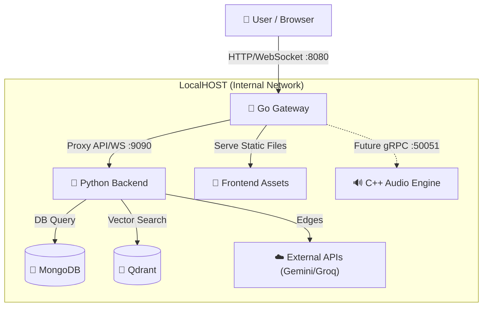

# 🏗️ AI Robot Guide Architecture & Roadmap (Hybrid Edition)

เอกสารฉบับนี้รวบรวมโครงสร้างสถาปัตยกรรมล่าสุด (Hybrid Python-Go-C++) และแผนการพัฒนาในอนาคต เพื่อใช้ในการส่งต่องาน

---

## 🏛️ 1. สถาปัตยกรรมในอนาคต (Current Architecture)

ระบบทำงานภายใต้คอนเซปต์ **"One Port to Rule Them All"** โดยมี **Go Gateway (Port 8080)** เป็นจุดเข้าถึงเดียวของระบบ

### 🔌 Connectivity Diagram



### COMPONENT DUTIES (หน้าที่รับผิดชอบ)

#### 1. 📂 Frontend (Vanilla JS)
- จุดเข้าถึง: `http://localhost:8080`
- หน้าที่: แสดงผล UI, จัดการ Audio Queue, ส่ง WebAudio แบบ Streaming
- **การเชื่อมต่อ:** เชื่อมต่อหา `ws://localhost:8080/ws/avatar` เท่านั้น (ไม่รู้จัก Python โดยตรง)

#### 2. 🐹 Go Gateway (Port 8080)
- หน้าที่:
    - **Reverse Proxy:** รับ Traffic ทั้งหมดจาก Frontend แล้วส่งต่อให้ Python
    - **WebSocket Proxy:** ดูแลท่อส่งข้อมูล Real-time ระหว่าง Frontend <-> Python
    - **Static File Server:** เสิร์ฟไฟล์ HTML/CSS/JS/Images
    - **Security:** เป็นด่านหน้า (อนาคตสามารถใส่ Rate Limit / Auth ได้ที่นี่)

#### 3. 🐍 Python Backend (Port 9090)
- **Status:** `Active (Listening on 127.0.0.1 ONLY)`
- หน้าที่:
    - **Brain (Business Logic):** ควบคุมการทำงานของ Avatar, RAG, Chat
    - **TTS (Text-to-Speech):** ใช้ `edge-tts` (Streaming) ตัดคำและส่งเสียงเป็นประโยค
    - **Integration:** เชื่อมต่อกับ LLM (Gemini/Groq) และ Database

#### 4. 🔊 C++ Audio Engine (Port 50051)
- **Status:** `Standing By (Running)`
- หน้าที่: รอรับงาน STT/TTS หนักๆ ในอนาคต (High Performance Computing)

---

## 🗺️ 2. แผนการพัฒนา (Development Roadmap)

### ✅ Phase 1-7 (Completed)
- [x] จัดการ Python Environment (`.venv-robot`)
- [x] แก้ไข UI/UX และ Responsive Design
- [x] ย้าย Database ไป Docker
- [x] พัฒนา Streaming TTS (พูดทันทีไม่ต้องรอจบประโยค)
- [x] สร้าง Go Gateway และบังคับใช้ "One Port Policy"

### 🚧 Phase 8: High Performance STT (Next Step)
**เป้าหมาย:** ย้ายงาน "ฟังเสียง" (STT) ออกจาก Python ไปให้ C++
1.  **Python:** หยุดโหลดโมเดล Whisper เอง
2.  **Go Gateway:** รับ Audio Stream จาก Frontend
3.  **Go Gateway:** ส่ง Audio Stream ไปเข้า **C++ Engine (gRPC)** แทน
4.  **Result:** ได้ Text กลับมา -> ส่งเข้า Python เพื่อประมวลผลต่อ
*ประโยชน์: ลดภาระ RAM ของ Python และทำให้การฟังเสียงไวขึ้น 2-3 เท่า*

### 🔮 Phase 9: High Performance TTS (Future)
**เป้าหมาย:** ย้ายงาน "พูด" (TTS) ไป C++ (ถ้า EdgeTTS มีปัญหา หรือต้องการ Offline 100%)
*หมายเหตุ: ปัจจุบัน EdgeTTS ดีมากอยู่แล้ว อาจจะยังไม่จำเป็นต้องรีบทำ*

### 🔮 Phase 10: Business Logic Migration (Long Term)
**เป้าหมาย:** ย้าย Logic เบาๆ (เช่น CRUD, User Management) มาเขียนด้วย Go
- ให้ Python เหลือแค่หน้าที่ "คุยกับ AI" เท่านั้น
- จะทำให้ระบบรองรับคนใช้งานพร้อมกันได้หลักพันคนสบายๆ

---

## 📝 3. วิธีการส่งต่องาน (Handover Instructions)

### การรันโปรเจกต์ (Standard Procedure)
ใช้คำสั่งเดียวจบ ห้ามรันแยกเอง:
```bash
./start_all.sh
```

### ไฟล์สำคัญที่ต้องรู้
- `frontend/assets/scripts/config.js`: ตั้งค่า Port (ต้องเป็น 8080)
- `go-gateway/internal/handlers/websocket.go`: หัวใจสำคัญของระบบ Proxy
- `Back-end/core/ai_models/speech_handler.py`: ตัวจัดการเสียงพูด (Streaming Logic)

### ข้อควรระวัง
1.  **ห้ามแก้ Port:** 9090 ห้ามเปิดออก Public เด็ดขาด (Security Risk)
2.  **Database:** ก่อนรันจริงจัง ตรวจสอบว่า Docker Containers (`mongo`, `qdrant`) รันอยู่เสมอ
3.  **Keys:** ไฟล์ `.env` ใน Back-end ห้ามหาย

---
*Generated by Antigravity (AI Assistant) - 14 Dec 2025*
