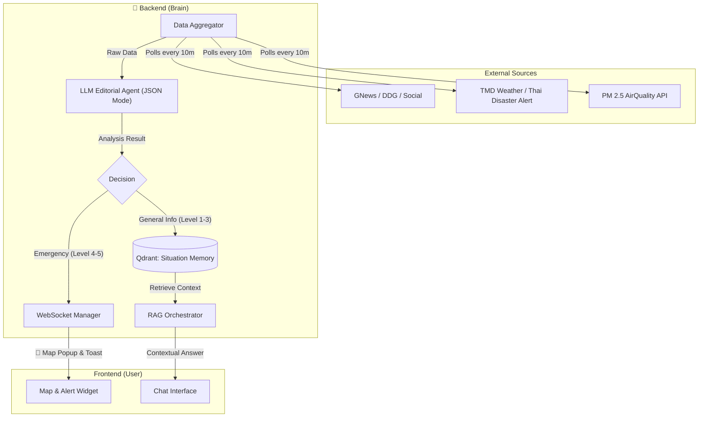

# 🌐 แผนพัฒนาระบบข่าวน่านแจ้งเตือนภัยอัจฉริยะ (Smart News Monitor & Intelligent Alert System)

เอกสารฉบับนี้อธิบายแนวทางการพัฒนาระบบ **"นักข่าวดิจิทัลประจำจังหวัดน่าน"** ที่ไม่ได้ทำหน้าที่แค่แจ้งเตือน แต่มีระบบคิดวิเคราะห์ (AI Analysis) เพื่อคัดกรองข่าวสำคัญและนำไปใช้ประกอบการตอบคำถามของหุ่นยนต์

---

## 1. แนวคิดหลัก (Concept): "รู้ทันสถานการณ์ ปลอดภัยทุกการเดินทาง"

เราจะผสานข้อมูลจาก **Sensor ภาครัฐ** (ที่เชื่อถือได้ 100%) เข้ากับ **AI News Analysis** (ที่เข้าใจบริบท) เพื่อสร้างระบบแจ้งเตือนที่ "เทพ" ที่สุด

*   **Hybrid Data Source:** ไม่พึ่งแค่ข่าว แต่ดึงค่าฝุ่น (PM2.5) และพยากรณ์อากาศจาก Sensor จริง
*   **Situation Awareness:** ส่งข้อมูลเข้าความจำหุ่นยนต์ (RAG) ให้ตอบคำถามโดยอิงสถานการณ์ปัจจุบัน
*   **Visual Alert:** แสดงจุดเกิดเหตุบนแผนที่ทันที (Map Notification)

---

## 2. สถาปัตยกรรมระบบ (Technical Architecture)



---

## 3. รายละเอียดฟีเจอร์และฟังก์ชันอัจฉริยะ

### 3.1 Advanced Data Sources (แหล่งข้อมูลขั้นเทพ)
เราจะเชื่อมต่อแหล่งข้อมูลภาครัฐเพิ่มเติมนอกเหนือจากข่าว เพื่อความแม่นยำสูงสุด:
1.  **Thai Meteorological Department (TMD) API:** ดึงสภาพอากาศรายชั่วโมงของ จ.น่าน (แจ้งเตือนพายุฤดูร้อน)
2.  **PM 2.5 API (AirVisual/OpenAQ):** จ.น่าน มีปัญหาเรื่องฝุ่นควันช่วงต้นปี ข้อมูลนี้สำคัญมากสำหรับนักท่องเที่ยว
3.  **News Scraper:** `gnews` + `duckduckgo-search` (Focus Keywords: "น่าน", "น้ำป่า น่าน", "ไฟป่า น่าน", "ถนนปิด น่าน")

### 3.2 The "Editorial Filter" Engine (JSON Mode) 🧠
เปลี่ยนจาก Free Text เป็น **Structured Output** เพื่อความชัวร์ในการนำไปใช้ต่อ

**Prompt Logic:**
*"วิเคราะห์ข้อมูลต่อไปนี้ แล้วตอบกลับเป็น JSON เท่านั้น:"*
```json
{
  "is_relevant": true,
  "category": "disaster", // disaster, traffic, weather, event, general
  "severity_score": 5,    // 1 (FYI) - 5 (CRITICAL)
  "summary": "น้ำป่าไหลหลากที่หมู่บ้านสะปัน ห้ามรถเล็กผ่าน",
  "location": {
      "name": "หมู่บ้านสะปัน", 
      "lat": 19.1918, 
      "lon": 101.1963 
  },
  "valid_until": "2025-10-25T18:00:00", // AI ประเมินเวลาสิ้นสุดเหตุการณ์
  "action_recommendation": "avoid_route" 
}
```
*   **Geocoding:** ให้ LLM Extract ชื่อสถานที่และหาพิกัด (หรือใช้ Database พิกัดอำเภอในน่านมา Cross-check) เพื่อนำไป Plot บนแผนที่

### 3.3 การแสดงผล (Visual & Contextual)

#### A. Real-time Map Alert 📍
*   เมื่อมีข่าวระดับ 4-5 (Critical):
    *   เด้ง **Popup** แจ้งเตือนมุมขวาบน (Toast)
    *   แสดง **Icon ตกใจกระพริบ** 🔴 บนแผนที่ท่องเที่ยวในจุดที่เกิดเหตุ
    *   กดที่ Icon จะโชว์รายละเอียดและคำแนะนำ (เช่น "เลี่ยงเส้นทาง")

#### B. RAG Integration (Situation Awareness) 🌟
*   นำ JSON `summary` และ `action_recommendation` ไปเก็บลง **Qdrant**
*   **Time-to-Live (TTL):** ใช้ฟิลด์ `valid_until` ในการตั้งเวลาลบข้อมูลออก (Memory Management) เพื่อไม่ให้จำเรื่องเก่ามาตอบ
*   **Chat Experience:**
    *   *User:* "จะไปสะปันวันนี้"
    *   *AI:* "ไม่แนะนำค่ะ! 🔴 **มีแจ้งเตือนน้ำป่าไหลหลากเมื่อ 1 ชั่วโมงที่แล้ว** รถเล็กห้ามผ่าน อันตรายมากค่ะ แนะนำให้เปลี่ยนแผนไป..."

---

## 4. แผนการพัฒนา (Implementation Roadmap)

### Phase 1: Data Piping (เชื่อมท่อข้อมูล)
*   เขียน Service ดึงข้อมูล TMD และ PM2.5 (ง่าย/ฟรี)
*   เขียน News Scraper พื้นฐาน

### Phase 2: AI Brain & Geocoding (สมองแยกแยะ)
*   ปรับ Prompt ให้ LLM ตอบเป็น JSON (ตาม Structure ข้างต้น)
*   ทดสอบความแม่นยำของพิกัด (Geocoding) ใช้ Google Maps API หรือ Mockup ฐานข้อมูลพิกัดสถานที่ในน่าน

### Phase 3: Integration & UI
*   แก้ไข `chat_api.py` ให้รองรับ WebSocket Message แบบใหม่ (มีพิกัด)
*   เพิ่ม Layer บนแผนที่ Frontend เพื่อแสดง Icon แจ้งเตือน

---

## 5. สรุปความเปลี่ยนแปลง
จากระบบแจ้งเตือนข่าวธรรมดา กลายเป็น **"ศูนย์บัญชาการข้อมูลอัจฉริยะ"** ที่:
1.  **เชื่อถือได้** (ใช้ข้อมูล Sensor ภาครัฐ)
2.  **แม่นยำ** (AI คัดกรองและให้พิกัดจริง)
3.  **ฉลาดล้ำ** (รู้เวลาหมดอายุของข่าวและนำไปใช้ตอบโต้ตอบได้)

ระบบนี้จะทำให้น้องน่านเป็นไกด์ที่ "พึ่งพาได้จริง" ในยามคับขันครับ!
