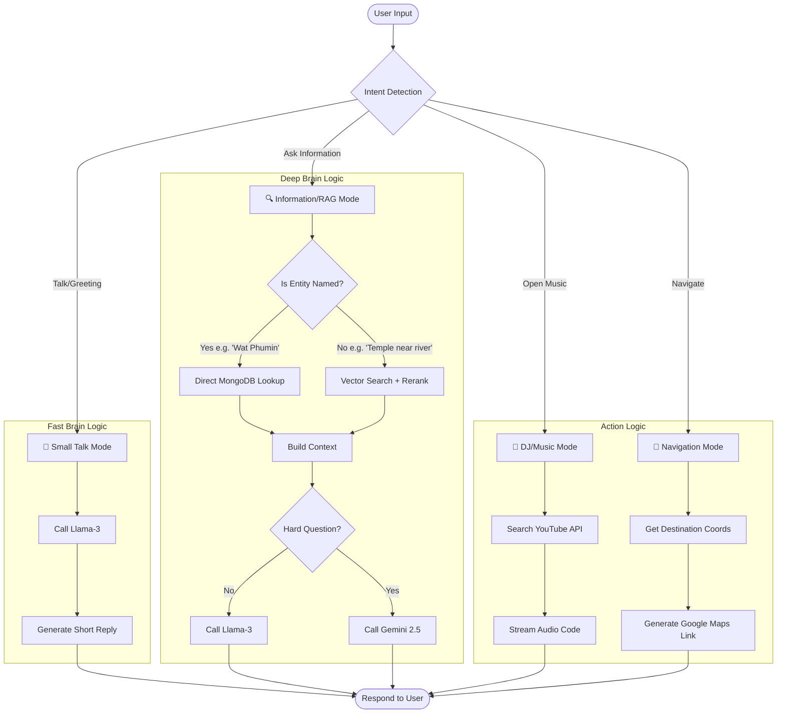
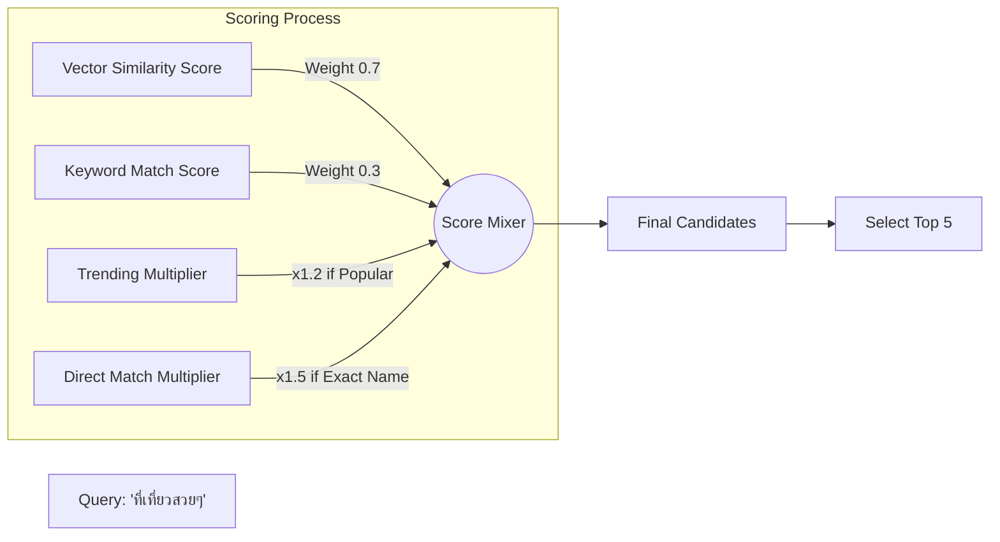
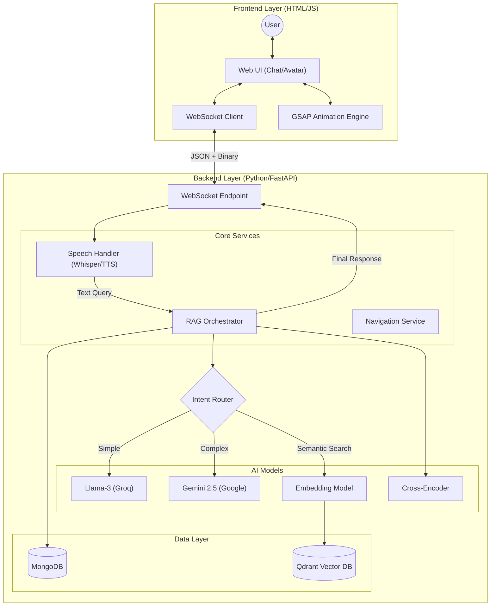

<div style="text-align: center; padding-top: 50px;">

# AI Robot Guide: จังหวัดน่าน

## Comprehensive Project Documentation
*(เอกสารสรุปโครงการฉบับสมบูรณ์)*

**Version:** 1.2  
**Date:** December 17, 2025  
**Developer:** MikeDev Team


</div>

<div style="page-break-after: always;"></div>

## 📑 สารบัญ (Table of Contents)

1.  **[บทที่ 1: ภาพรวมความสามารถ (Project Capabilities)](#chapter-1-project-capabilities)**
    *   วิสัยทัศน์และแนวคิด
    *   ฟีเจอร์หลัก (Key Features)
    *   ตารางเปรียบเทียบฟีเจอร์
2.  **[บทที่ 2: คู่มือการใช้งาน (User Manual)](#chapter-2-user-manual)**
    *   สำหรับนักท่องเที่ยว (Travelers)
    *   สำหรับผู้ดูแลระบบ (Admins)
3.  **[บทที่ 3: อัลกอริทึมและการทำงาน (Algorithms & Logic Flow)](#chapter-3-algorithms)**
    *   แผนผังการตัดสินใจ (Decision Tree)
    *   ขั้นตอนการค้นหาและให้คะแนน (RAG Scoring)
4.  **[บทที่ 4: สถาปัตยกรรมระบบเชิงลึก (Architecture Deep Dive)](#chapter-4-architecture-deep-dive)**
    *   แผนภาพระบบ (System Diagram)
    *   ส่วนประกอบหลัก (Component Breakdown)
    *   กระบวนการทำงาน (Data Flow)

---

<div style="page-break-after: always;"></div>

## <a name="chapter-1-project-capabilities"></a> 🌟 บทที่ 1: ภาพรวมความสามารถ (Project Capabilities)

### 1.1 วิสัยทัศน์และแนวคิด (Vision)
**"น้องน่าน"** คือระบบ AI Avatar Guide อัจฉริยะที่ถูกออกแบบมาเพื่อปฏิวัติประสบการณ์การท่องเที่ยวในจังหวัดน่าน โดยการเปลี่ยนตู้ Kiosk ธรรมดาให้กลายเป็น "เพื่อนร่วมทาง" ที่มีชีวิตชีวา พูดคุยได้จริง และมีความรู้ลึกรู้จริงเกี่ยวกับจังหวัดน่าน

ระบบผสมผสาน **ความน่ารัก (Avatar Interaction)** เข้ากับ **ความฉลาด (Advanced AI)** เพื่อให้ข้อมูลท่องเที่ยว วางแผนทริป และสร้างความประทับใจให้กับนักท่องเที่ยว

### 1.2 ฟีเจอร์หลัก (Key Features)

#### 🤖 Interactive AI Avatar
*   **3D Character Interaction:** หุ่นยนต์ 3 มิติที่มีการเคลื่อนไหวสมจริง ขยับตา ปาก และแขนได้ตามอารมณ์ของการสนทนา
*   **Voice-First Experience:** รองรับการสั่งงานด้วยเสียง 100% พูดคุยได้เหมือนคนจริง
*   **Smart Emotions:**
    *   😲 **ตกใจ/สนใจ:** เมื่อได้รับคำสั่งเสียง
    *   🤔 **ครุ่นคิด:** ขณะระบบกำลังหาข้อมูล
    *   😊 **ยิ้มแย้ม:** ขณะนำเสนอข้อมูล
    *   🗣️ **Lip-Sync:** ปากขยับตรงตามเสียงพูด (Streaming Lip Sync Technology)

#### 🧠 ระบบสมองคู่ขนาน (Dual-Brain RAG Architecture)
ระบบใช้ AI สองส่วนทำงานร่วมกัน:
1.  **Fast Brain (Llama 3 @ Groq):** รับผิดชอบการโต้ตอบทั่วไป (Small Talk) ทักทาย เล่นมุก ตอบเร็วใน < 0.5 วินาที
2.  **Deep Brain (Gemini 2.5):** รับผิดชอบข้อมูลเชิงลึก การวางแผนเที่ยว การอ่านเอกสาร และการวิเคราะห์คำถามยากๆ

#### 🔍 ระบบค้นหาอัจฉริยะ (Smart Retrieval System)
*   **Hybrid Search:** ค้นหาได้ทั้งแบบ "คำเฉพาะ" (Keyword) และ "ความหมาย" (Semantic) เช่น พิมพ์ "ที่เที่ยวสงบๆ เหมาะนั่งสมาธิ" ระบบจะแนะนำวัดป่าให้ แม้ไม่มีคำว่า "สงบ" ในชื่อ
*   **Direct Entity Bypass:** ถ้าระบุชื่อสถานที่ชัดเจน (เช่น "วัดภูมินทร์") ระบบดึงข้อมูลตรงจากฐานข้อมูลทันที แม่นยำ 100%
*   **Trending Boost:** ระบบเรียนรู้และแนะนำสถานที่ยอดฮิตก่อนเสมอ

#### 🧭 นำทางและข้อมูล (Navigation & Info)
*   **Smart Routing:** คำนวณระยะทางและเส้นทางไปยังสถานที่เที่ยว
*   **In-Chat Map:** แสดง Google Maps ในหน้าแชททันทีที่ถามทาง
*   **Dynamic Gallery:** แสดงอัลบั้มรูปภาพสวยๆ ของเมืองน่านประกอบการเล่าเรื่อง

#### 🎵 ความบันเทิง (Entertainment)
*   **DJ Mode:** สั่งเปิดเพลงจาก YouTube ได้ทันทีด้วยเสียง ("เปิดเพลงน่านเนิบๆ")
*   **Story Telling:** เล่าตำนานพื้นบ้านและเกร็ดความรู้ประวัติศาสตร์

### 1.3 ตารางสรุปความสามารถ (Feature Matrix)

| ความสามารถ (Capability) | รายละเอียดทางเทคนิค (Technical Spec) | ประโยชน์ (Benefit) |
| :--- | :--- | :--- |
| **การโต้ตอบด้วยเสียง** | Web Speech API + Faster Whisper | คุยเป็นธรรมชาติ ไม่ต้องพิมพ์ |
| **ความแม่นยำข้อมูล** | Cross-Encoder Reranking + Qdrant | ข้อมูลเที่ยงตรง ไม่มั่ว (Hallucination reduced) |
| **ความเร็วในการตอบ** | Llama-3 (Groq) < 0.5s Latency | รู้สึกเหมือนคุยกับคนจริงๆ / ไม่ดีเลย์ |
| **การจัดการข้อมูล** | AI-Powered ETL (Gemini Doc Parser) | อัปโหลด PDF เป็น Database อัตโนมัติ |
| **Analytics** | MongoDB Tracking | วิเคราะห์เทรนด์ความสนใจของนักท่องเที่ยว |

---

<div style="page-break-after: always;"></div>

## <a name="chapter-2-user-manual"></a> 🎒 บทที่ 2: คู่มือการใช้งาน (User Manual)

### 2.1 สำหรับนักท่องเที่ยว (For Travelers)

การใช้งาน "น้องน่าน" ถูกออกแบบมาให้ง่ายที่สุด เหมือนการคุยกับเพื่อน

#### วิธีการโต้ตอบ
1.  **🗣️ พูดคุย (แนะนำ):** กดปุ่มไมโครโฟนสีฟ้า แล้วพูดคำถามได้เลย
2.  **⌨️ พิมพ์:** พิมพ์ข้อความในช่องแชทด้านล่าง

#### ตัวอย่างคำสั่งที่ใช้บ่อย

**1. ถามข้อมูลท่องเที่ยว**
> * "แนะนำที่เที่ยวในตัวเมืองน่านหน่อย"
> * "มีร้านกาแฟบรรยากาศดีๆ แถวปัวไหม?"
> * "วัดภูมินทร์ปิดกี่โมง?"
> * "ของกินเมืองน่านมีอะไรอร่อยบ้าง?"

**2. ฟังเพลงแก้เหงา (DJ Mode)**
> * "เปิดเพลงล้านนาให้ฟังหน่อย"
> * "อยากฟังเพลงของ ปู่จ๋าน ลองไมค์"

**3. นำทาง (Navigation)**
> * "พาไปวัดพระธาตุแช่แห้งหน่อย"
> * "ขอเส้นทางไปร้านเฮือนเจ้านาง"

**4. คุยเล่นทั่วไป**
> * "สวัสดีจ้า น้องน่านชื่ออะไร?"
> * "เล่านิทานให้ฟังหน่อย"

---

### 2.2 สำหรับผู้ดูแลระบบ (For Admins)

ผู้ดูแลระบบสามารถเข้าถึงหน้าจัดการได้ที่ `/admin.html`

#### 📊 Dashboard (ภาพรวม)
*   ดูสถิติจำนวนผู้ใช้งานรายวัน
*   ดูคำค้นหายอดฮิต (Top Queries)
*   ดูสถานที่ที่คนสนใจมากที่สุด (Popular Locations)

#### 📝 Location CMS (จัดการข้อมูล)
*   **เพิ่มสถานที่:** กด "เพิ่มสถานที่ใหม่" -> กรอกชื่อ, รายละเอียด, พิกัด -> บันทึก
*   **แก้ไข/ลบ:** ค้นหาชื่อสถานที่ในตาราง และกดปุ่มดินสอหรือถังขยะ
*   **Sync Images:** ระบบจะดึงรูปจากโฟลเดอร์ `/static/images` มาแสดงอัตโนมัติ (ตั้งชื่อไฟล์เป็น `slug-01.jpg`)

#### ✨ AI Magic Import (นำเข้าข้อมูลอัตโนมัติ)
1.  เตรียมไฟล์ PDF หรือ Text ข้อมูลท่องเที่ยว (เช่น โบรชัวร์, บทความ)
2.  ไปที่เมนู **"Import"** และอัปโหลดไฟล์
3.  กด **Analyze:** AI จะอ่านและสรุปข้อมูลให้
4.  ตรวจสอบความถูกต้อง และกด **Save to Database**

---

<div style="page-break-after: always;"></div>

## <a name="chapter-3-algorithms"></a> 🧠 บทที่ 3: อัลกอริทึมและการทำงาน (Algorithms & Logic Flow)

ส่วนนี้จะอธิบาย "วิธีคิด" ของระบบอย่างละเอียดผ่านแผนภาพ (Diagrams)

### 3.1 อัลกอริทึมการตัดสินใจ (Decision Making Algorithm)

เมื่อผู้ใช้พูดหรือพิมพ์เข้ามา ระบบจะใช้ **Intent Classification Model** ในการตัดสินใจว่าจะทำอะไรต่อ ตามแผนภาพด้านล่าง:



**คำอธิบายการทำงาน:**
1.  **Intent Detection:** ระบบแยกแยะเจตนาของผู้ใช้เป็น 4 กลุ่มหลัก (คุยเล่น, หาข้อมูล, ฟังเพลง, นำทาง)
2.  **Logic Branching:** แยกไปทำงานตาม function ที่เหมาะสม
    *   *คุยเล่น:* ใช้ Fast Brain (Llama) ตอบทันที
    *   *หาข้อมูล:* เข้าสู่กระบวนการ RAG (ค้นหา -> กรอง -> ตอบ)
    *   *ฟังเพลง:* ยิง API ไป YouTube เพื่อหา Video ID
    *   *นำทาง:* ค้นหาพิกัดและสร้าง Link แผนที่

---

### 3.2 ขั้นตอนการค้นหาและให้คะแนน (Simulated RAG Scoring Algorithm)

ระบบใช้สูตรการคำนวณคะแนน (Scoring) เพื่อเลือก "สถานที่ที่ดีที่สุด" มานำเสนอ โดยพิจารณาจากหลายปัจจัย:



**สูตรการคำนวณ (Simplified Pseudocode):**
```python
def calculate_score(document, query):
    base_score = (vector_similarity * 0.7) + (keyword_match * 0.3)
    
    # Boost Multipliers
    if document.is_trending:
        base_score *= 1.2  # เพิ่มคะแนน 20% ถ้าเป็นที่ยอดฮิต
        
    if document.name == query.entity_name:
        base_score *= 1.5  # เพิ่มคะแนน 50% ถ้าชื่อตรงเป๊ะ
        
    return base_score
```

---

<div style="page-break-after: always;"></div>

## <a name="chapter-4-architecture-deep-dive"></a> 🏗️ บทที่ 4: สถาปัตยกรรมระบบเชิงลึก (Architecture Deep Dive)

ส่วนนี้อธิบายการทำงานเบื้องหลังสำหรับฝ่ายเทคนิค

### 3.1 แผนภาพระบบ (System Architecture)



### 3.2 ส่วนประกอบหลัก (Component Breakdown)

#### 1. Frontend Layer
*   **Technology:** HTML5, TailwindCSS, Vanilla JS
*   **Animation Engine:** GSAP (GreenSock) ควบคุมการขยับของ SVG Avatar (ตา, ปาก, แขน)
*   **Socket:** เชื่อมต่อ WebSocket เพื่อรับส่ง Audio Stream แบบ Real-time

#### 2. Backend Layer
*   **Core:** Python 3.12, FastAPI, Uvicorn
*   **Module:**
    *   `speech_handler.py`: จัดการ STT (Deepgram/Whisper) และ TTS (EdgeTTS)
    *   `rag_orchestrator.py`: สมองหลัก ควบคุม Flow การทำงาน
    *   `ai_mapper.py`: ระบบ ETL อัจฉริยะ

#### 3. AI & Data Layer
*   **Vector DB (Qdrant):** เก็บ Embedding ของข้อมูลสถานที่ เพื่อการค้นหาเชิงความหมาย
*   **NoSQL DB (MongoDB):** เก็บข้อมูลรายละเอียด (Metadata), Logs, และ User Session
*   **Models:**
    *   `intfloat/multilingual-e5-large` (Embedding)
    *   `BAAI/bge-reranker-base` (Reranking)

### 3.3 กระบวนการทำงาน (End-to-End Data Flow)

1.  **Input:** เสียงพูดของผู้ใช้ถูกส่งผ่าน WebSocket เป็น Binary Stream
2.  **Transcription:** Backend แปลงเสียงเป็นข้อความด้วย Whisper
3.  **Intent Classification:** ระบบวิเคราะห์เจตนา (คุยเล่น / หาข้อมูล / ฟังเพลง)
4.  **Retrieval (RAG):**
    *   ค้นหาใน Vector DB (Qdrant)
    *   ค้นหาใน MongoDB (Keyword & Direct Match)
5.  **Reranking:** นำผลลัพธ์มาให้คะแนนใหม่ด้วย Cross-Encoder เพื่อความแม่นยำสูงสุด
6.  **Generation:** ส่งข้อมูลให้ LLM (Llama/Gemini) เรียบเรียงคำตอบ
7.  **Response:** ส่งข้อความกลับไปแสดงผล และ Stream เสียงตอบกลับไปเล่นที่ Client

---
<div style="text-align:center; margin-top:50px; color:gray;">
© 2025 AI Robot Guide Project. All Rights Reserved.
</div>
